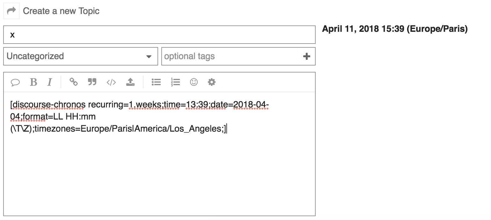
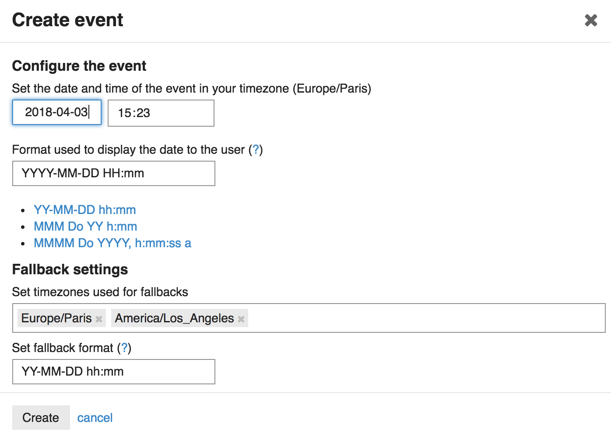

# discourse-chronos

Adds relative time support to Discourse. This plugin lets you create an event with a date and time in a post which will always be shown to the user in its current timezone.

## Installation

Follow our [Install a Plugin](https://meta.discourse.org/t/install-a-plugin/19157)
howto, using `git clone https://github.com/jjaffeux/discourse-chronos.git`
as the plugin command.

To enable, make sure the `discourse chronos enabled` site setting is set to true.

## Contributing

Help make this plugin better by submitting a PR.  It's as easy as 1-2-3

* fork the repo
* create a feature branch
* rebase off master and send the pr

This project uses MIT-LICENSE.

## Todo/pr-welcome
- Make it part of discourse-core ?
- Adds preview support on mobile (title attribute doesn’t work here)
- Better integration with other parts of discourse (titles, polls...)
